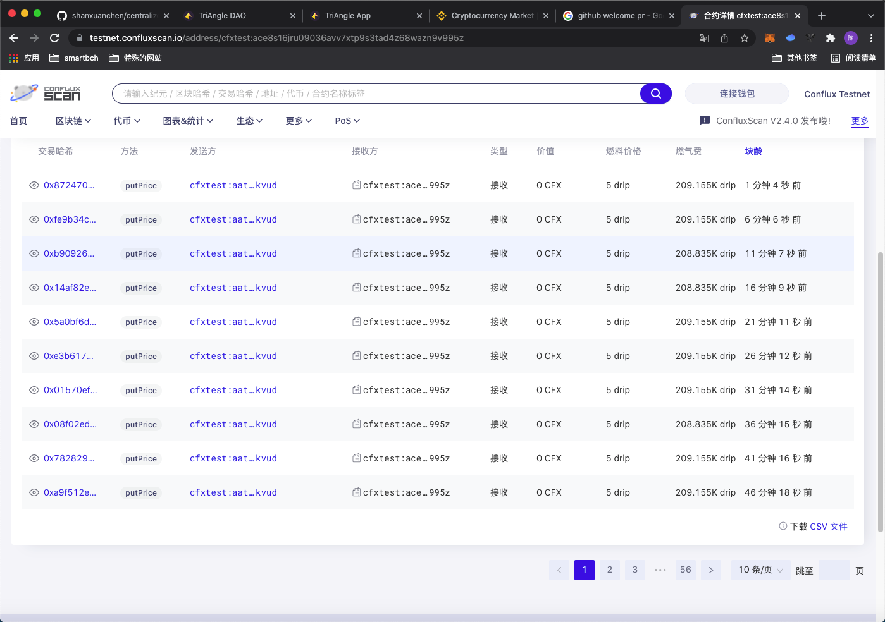

<!--
 * @Author: your name
 * @Date: 2021-10-26 22:13:04
 * @LastEditTime: 2021-10-26 22:34:20
 * @LastEditors: Please set LastEditors
 * @Description: In User Settings Edit
 * @FilePath: /triangleBlockchainOracle/readme.md
-->

# Centralized-Pricefeed

Centralized-Pricefeed is a centralized blockchain oracle service, reading data from binance and okex api, and writing data to the contract. 

Contract Deail: 

https://testnet.confluxscan.io/address/cfxtest:ace8s16jru09036avv7xtp9s3tad4z68wazn9v995z





## Prepare

``` bash

npm install -g conflux-truffle

# recommend using venv in python
pip install python-binance
pip install cryptography
pip install conflux
pip install pymysql
pip install dbutils


# for email sdk

pip install --upgrade sentry-sdk

```

## ABI Generation

We need to generate an ABI from the triangleOracle.sol. 

``` bash
git clone https://github.com/Conflux-Chain/conflux-abigen.git

go install ./cmd/cfxabigen

brew update
brew tap ethereum/ethereum
brew install solidity

sudo solc --abi contracts/triangleOracle.sol -o build

```
## Compile and deploy contracts 

``` bash
cfxtruffle compile

cfxtruffle migrated --network testnet

```
### Mysql prepare

``` bash

# Doing in DB-Client (such as Mysql Workbench ...)

create db name triangleOracle

import db from src/db/oracle_price.sql

```

### Run service


``` bash
# recommend using venv in python

cd src

python run.py --symbol CFX

```

## Communication

Hope to help blockchain to build a centralized blockchain oracle service. If you find any question, pelease eamil: 781244184@qq.com or csx.software.engineer@gmail.com. Welcome any PR here.


